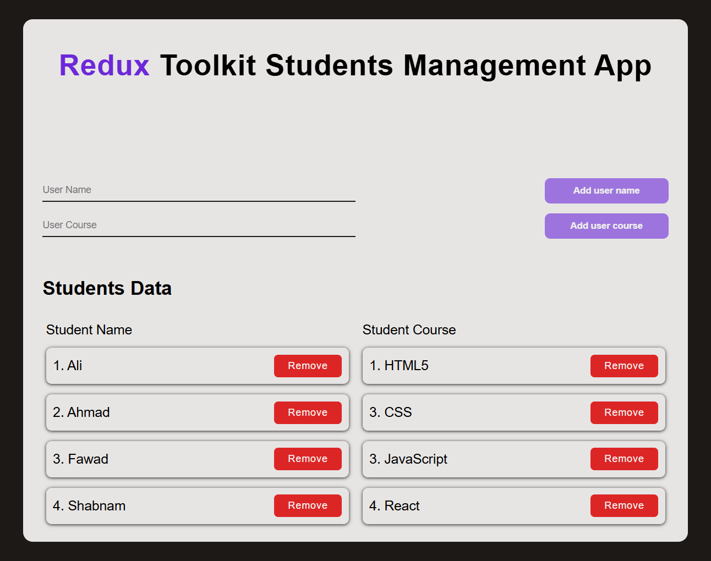

# Redux Toolkit Students Management App

A simple **React** app using **Redux Toolkit** to manage student names and their courses. Users can add and remove students and their courses dynamically.

---

## 📸 Screenshot



---

## 🌏 Live Demo

[Click here to see the live demo](https://aymaq-code.github.io/Redux-Toolkit-Students-Management-System/)

---

## 💻 Features

- Add new student names.
- Add new courses for students.
- Remove student names or courses.
- Display all students and their corresponding courses.
- State is managed efficiently using **Redux Toolkit**.

---

## 🛠️ Technologies Used

- **React** for the frontend UI.
- **Redux Toolkit** for state management.
- **Vite** as the development build tool.
- **CSS** for styling.

---

## 🚀 Installation

1. Clone the repository:

```bash
git clone https://github.com/Aymaq-code/Redux-Toolkit-Students-Management-System.git
```
